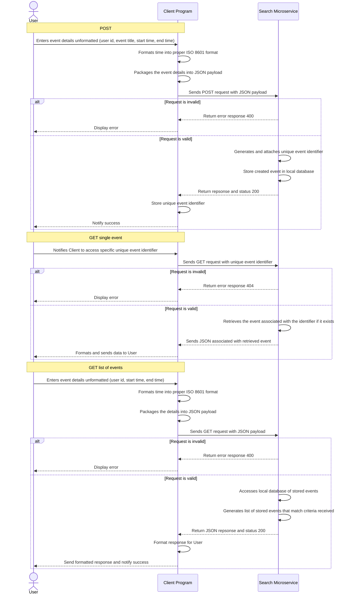

# Calendar-Microservice

## Description

This microservice takes client input data to either create an event, get and event, or list events. This requires the user send data over HTTP in a JSON format. The microservice runs on a local host. The functions executed, and the necessary data is as follows:

- create_event(): The client sends a JSON payload containing a user identification, a title for their event, a start time for the event, and an end time for the event. Created events are stored as a local database for as long as the server is running. This function creates a unique identifier called that identifies the created event in the local database.

- get_event(): The client can retrieve a previously created event using the previously generated unique identifier. The get will return a JSON payload with user identification, the title of the event, the start time for the event, and the end time for the event.

- list_event(): The client can retrieve a list of all previously created events by a specific user, within a time window (inclusive of the start and end time). The client sends a GET request with user identification, the start time of the desired covered period and the end time of the desired period covered.
  
  
  
  
  
## Files

- calendar_service.py

- test_calendar.py
  
  
  
  
  
## Requirements

Install Flask

```bash
pip install flask 
```

Install requests

```bash
pip install requests
```
  
  
  
  
  
## Running the microservice and test

Start the service

```bash
python calendar_service.py
```

By default the microservice and the test program run on local host at

```text
http://127.0.0.1:5002/calendar/events
```

- The port in calendar_service.py can be modified at the bottom of the program

```python
if __name__ == '__main__':
    app.run(port=5002, debug=False)
```

- The port in test_calendar.py can be modified at the top of the program


```python
url = "http://127.0.0.1:5002/calendar/events"
```


With the service running, in another terminal window, run the test

```bash
python calendar_service.py
```
  
  
  
  
  
## Communication Contract

The resquest for all functions in the microservice must contain data formatted as a JSON object. The JSON object can contain the fields as follows:

```json
{
    "user_id": "",
    "title": "",
    "start_time": "",
    "end_time": "",
}
```

Additionally, when intially creating an event, a unique event identifier is created and associated with the newly created event. This is then stored in local database, formatted like this

```json
{
        "event_id": "",
        "user_id": "",
        "title": "",
        "start_time": "",
        "end_time": "",
    }
```

Depending on desired execution the client sends JSON payload with all or some of these fields. 

Please note, the format for time must be input spefically in accordance with ISO 8601 format. It is the clients responsibility to format the date time group into ISO 8601 format like so

```
June 02, 2026, 1:00pm
```
in ISO8601 format becomes

```text
2026-06-02T13:00:00
```
  
  
  
  
  
### Example Execution
  
  
  
### Create Event
  
If the user wishes to create a new calendar event, the JSON payload might look like this
```json
payload = {
    "user_id": "John",
    "title": "Study",
    "start_time": "2026-06-01T14:00:00",
    "end_time": "2026-06-01T15:00:00",
}
```

If using Python, creating the new event can be executed like this
```python
response = requests.post(url, json=payload)
```

And the resulting unique event identifier can can be accessed like so
```python
created_event= response.json()
event_id = created_event["event_id"]
```

The resulting unique event identifier might look something like this
```text
637fabe5-37c6-4583-8fba-de767eb6c827
```

It is the client's responsibility to access and store all unique identifiers for events they wish to access. The service retains the events and those identifiers, but in the case that there are otherwise identical events, the service does not discern.
  
  
  
### Get Event
  
If the user wishes to retrieve a previously created event, they can invoke get_event if they have the unique identifier

In python that might look something like the following:

- The url the service is running at
```python
url = "http://127.0.0.1:5002/calendar/events"
```
- The event identifier (which the client has stored somewhere)
```python
event_id = "637fabe5-37c6-4583-8fba-de767eb6c827"
```

- The call itself
```python
get_response = requests.get(url + "/" + event_id)

get_response.json()
```
  
  
  
### List Event

If the client wants to see a list of all previously created by a user and withing specific time window, they can invoke list_event() with the user identification, the start time of the window, and the end time of the window.

In python that might look like this

- The url the service is running at
```python
url = "http://127.0.0.1:5002/calendar/events"
```

- The payload that will be sent. This example will retrieve all events by user John btween 12:00pm and 6:00pm on June 1st 2026.
```python
payload = {
    "user_id": "John",
    "start_time": "2026-06-01T012:00:00",
    "end_time": "2026-06-01T18:00:00"
}
```

- The get request being sent with those parameters
```python
get_response = requests.get(url, params=payload)

get_response.json()
```

## Errors

## UML Sequence Diagram


